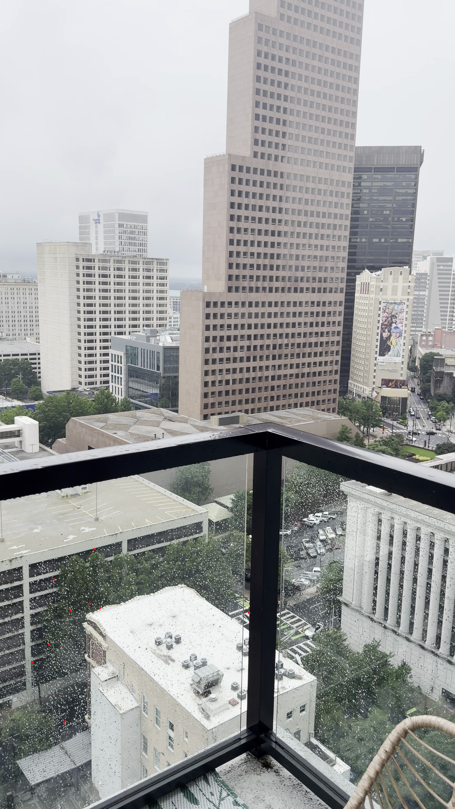
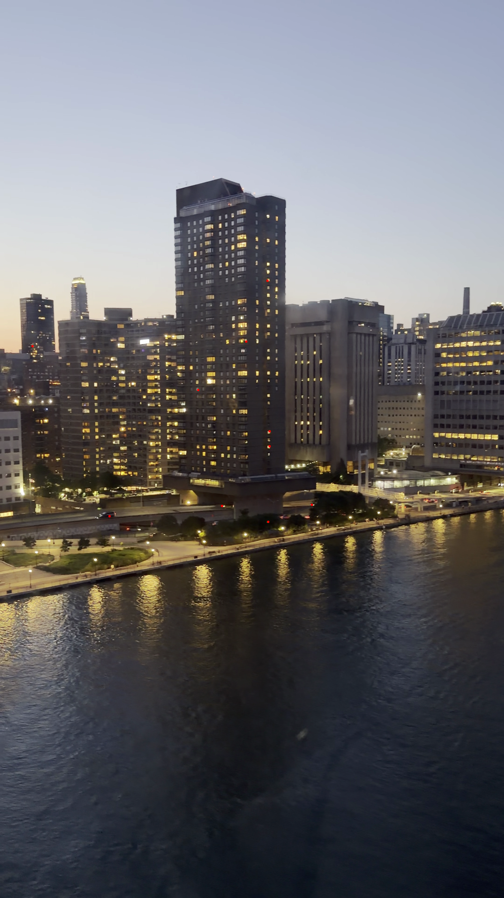
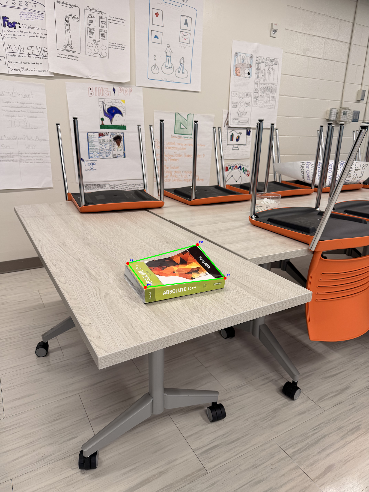

# Optical Flow, Feature Tracking & Structure from Motion

This project uses Python and OpenCV to analyze motion and multi-view geometry through dense optical flow, Lucas-Kanade feature tracking, and planar Structure-from-Motion techniques.

## Technologies Used

- Python
- OpenCV
- NumPy
- Farneback Optical Flow
- Lucas-Kanade Feature Tracking
- Homography Estimation
- Multi-View Geometry

## Project Overview

The project includes:

1. Dense optical flow visualization for two motion videos.
2. Consecutive-frame extraction and Lucas-Kanade feature tracking.
3. A planar Structure-from-Motion / multi-view geometry experiment using four viewpoints of a book cover.

## Project Structure

```text
ComputerVision_Module6/
├── README.md
├── extract_frames.py
├── optical_flow.py
├── sfm_manual_corners.py
├── structure_from_motion.py
├── track_points.py
├── requirements.txt
├── patio_tracking.png
├── tramway_tracking.png
├── manual_sfm_view2.png
├── manual_sfm_view3.png
├── manual_sfm_view4.png
├── sfm_corner_coordinates.txt
├── view1.jpeg
├── view2.jpeg
├── view3.jpeg
└── view4.jpeg
```

## Requirements

- Python 3
- OpenCV
- NumPy

Install the required dependencies:

```bash
python3 -m pip install -r requirements.txt
```

## How to Run

Run the following commands from the main `ComputerVision_Module6` folder.

### 1. Dense Optical Flow

Set the desired input and output filenames in `optical_flow.py`, then run:

```bash
python3 optical_flow.py
```

### 2. Extract Consecutive Frames

```bash
python3 extract_frames.py
```

### 3. Track Feature Points

```bash
python3 track_points.py
```

### 4. Initial Automatic Homography Experiment

```bash
python3 structure_from_motion.py
```

### 5. Final Manual-Corner Planar SfM Experiment

```bash
python3 sfm_manual_corners.py
```

For each of the four images, select the book corners in the following order:

1. Top-left
2. Top-right
3. Bottom-right
4. Bottom-left

Press **Enter** after selecting all four corners in each image.

## Methods

### Optical Flow

Dense motion is estimated using Farneback optical flow. Motion direction is represented by hue and motion magnitude by brightness in the generated HSV visualization.

### Point Tracking

Strong image features are detected in the first frame and tracked into the next frame using pyramidal Lucas-Kanade optical flow. The script reports the original and new pixel locations along with horizontal and vertical displacement.

### Planar Multi-View Geometry

The book is treated as a planar object. Four manually selected corresponding corners are used to estimate a 3 × 3 homography between View 1 and each additional viewpoint. The calculated transform is used to project the book boundary into the target views.

## Main Results

- Both videos produced working dense optical-flow visualizations.
- 50 feature points were tracked in each consecutive-frame pair.
- Patio motion was predominantly leftward at approximately 6 pixels per frame for the first ten tracked points.
- The tramway clip produced more varied motion across the frame.
- Homographies successfully mapped the four book corners from View 1 into Views 2, 3, and 4.

## Feature Tracking Results

### Patio Tracking



### Tramway Tracking



## Structure from Motion Results

### View 2



### View 3


### View 4


## References

- Farneback, G. (2003). *Two-frame motion estimation based on polynomial expansion.*
- Lucas, B. D., & Kanade, T. (1981). *An iterative image registration technique with an application to stereo vision.*
- OpenCV Optical Flow Tutorial
- OpenCV Homography Tutorial

## Project Purpose

This project was developed as part of graduate-level Computer Vision coursework to explore optical flow, feature tracking, homography estimation, and planar multi-view geometry using Python and OpenCV.
